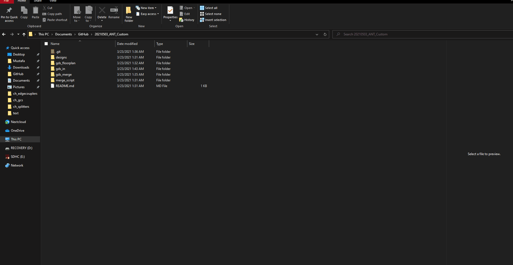

Pulled from SiEPICfab_ZEP04_Shuksan_20250215 README.md as this is the intent of this example

# Submission Process
We are using an automated merging script to combine the layouts.

Step 1: In this step, you allocate yourself space in the shared design space. 

Step 2: In this step, you create your personal design layout file, separate from the rest. This is the file that will contain your layout designs, please add your designs ONLY to that file in 'gds_in'. Commit your changes as your design changes.

Step 3: In this step, you merge your design layout file to the merged layout file to be submitted.

### Video tutorial on how to include and merge your designs
Follow the instructions below to merge your layout and designs. Please use [GitHub desktop](https://desktop.github.com/) to perform this process. If you're having trouble, please ask for help using the issues tab.

      

## Detailed instructions:

1. Step 1:  

  - Pull from GitHub the repo 
  - Open 'gds_floorplan'.
  - Open the floorplan layout file inside the folder.
  - Create a box using the 'FloorPlan' layer in which your design will fit in.
  - Turn the box into a cell with your name (Ctrl+Shift+M), Edit → Selection → Make Cell
  - Save the layout
  - **IMPORTANT** Commit back to GitHub. 

2. Step 2:  

  - Copy your cell from the floorplan file
  - Create a new layout file with dummy top cell
  - Paste the copied cell in the new layout file
  - Delete the original dummy top cell
  - Save your layout to 'designs' directory with the same name of your cell.
  - Use SiEPIC Tools 'Export to fabrication' to save your cell safely. (SiEPIC Menu → Export Design). This creates a layout with _static.oas added to the file name. Move that file to the 'gds_in' folder
  - **IMPORTANT** Commit back to GitHub.
"@
